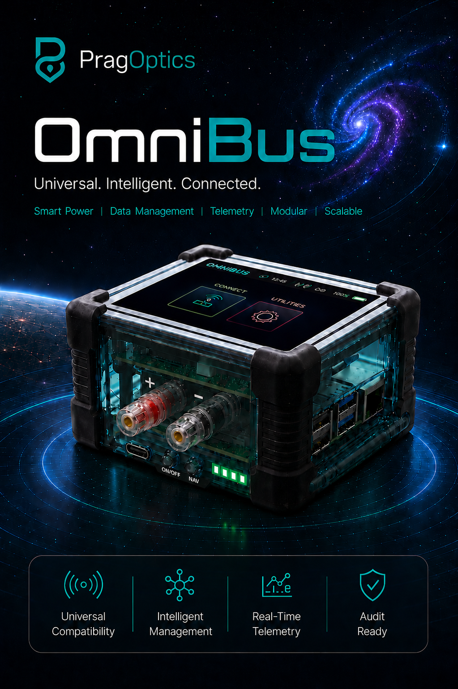

<!--
  OmniBus Product Brochure · PragOptics, Industrial Automation
  Page 1 = OmniBusProductFlyer.png (cover, lives in ./assets; keep that folder beside this file).
  Theme = galactic/dark, cyan #1fe0ff · teal #21bca5 · purple #bf7dff · violet #a200ff · green #38ffb3 · amber #ffcc33.
  The 

  
  
Product rendering. This illustration represents the OmniBus design as specified in engineering; the final production enclosure and a few visual details may vary. Nothing here affects the capabilities described in this brochure.

## Contents

1. [Why OmniBus exists](#why-omnibus-exists)
2. [What OmniBus is](#what-omnibus-is)
3. [The four pillars](#the-four-pillars)
4. [How it works](#how-it-works): the operator journey
5. [Core workflows](#core-workflows): Configure · Calibrate · Loop Test · Record
6. [The documents it produces](#the-documents-it-produces): certificates, reports, export
7. [PULSE](#pulse): device health, scored continuously
8. [Atlas](#atlas): deep instrument profiling
9. [The Historian](#the-historian): your field black box
10. [Connectivity and protocols](#connectivity-and-protocols)
11. [The hardware](#the-hardware)
12. [The PragOptics platform](#the-pragoptics-platform)
13. [Modular by design](#modular-by-design): what's standard, what's optional
14. [Security and trust](#security-and-trust)
15. [Built on standards](#built-on-standards)
16. [How OmniBus compares](#how-omnibus-compares)
17. [At a glance](#at-a-glance)
18. [Ownership and pricing](#ownership-and-pricing)
19. [Built to keep evolving](#built-to-keep-evolving)

  
PRAGOPTICS · INDUSTRIAL AUTOMATION

  <h1>OmniBus™</h1>
  
Universal · Intelligent · Connected

  
Smart Power · Data Management · Telemetry · Modular · Scalable

  
The handheld field node that turns every instrument connection into an auditable, certifiable record. Any HART device, any manufacturer, the paperwork already done.

  <a href="https://pragoptics.com">pragoptics.com</a> · <a href="https://fortiviewholdings.com">fortiviewholdings.com</a> · <a href="mailto:support@fortiviewholdings.com">support@fortiviewholdings.com</a> · <a href="tel:+18324250421">832-425-0421</a>

---

## Why OmniBus exists

An instrument technician's day is full of moments that matter and disappear: a transmitter trimmed, a loop forced, a range changed, a reading checked. The work gets done. The **proof** rarely survives the walk back to the truck.

OmniBus was built around one idea: **every interaction with an instrument is a human action worth recording.** Who did it, which device it actually was, what tool was used, what changed, when, where, why, and whether the result was right. OmniBus captures all of it automatically, turning routine field work into a defensible audit trail and a finished calibration record without slowing the technician down.

  Who did what, when, where, and why.
  That captured data <strong>is</strong> the product. Every connection becomes a QA/QC-grade record, generated as a by-product of doing the job.

It's a universal HART communicator, a calibration recorder, a device-health analyst, and a black-box recorder, in one rugged, battery-powered, encrypted, touchscreen device.

[↑ Contents](#contents)

---

## What OmniBus is

OmniBus is a handheld, Raspberry-Pi-class field node with a 5″ capacitive touchscreen, all-day battery, and a custom HART analog front-end. A technician powers it on, signs in, connects to an instrument, and gets to work: configuring, calibrating, loop-testing, and recording, while OmniBus builds a complete, timestamped history of the session in the background.

It is **vendor-neutral by design.** Instead of locking to one manufacturer's device descriptors, OmniBus speaks universal, common-practice HART and presents the technician with *instrument behavior*: "range it, trim it, verify it, prove it," never raw command numbers or byte payloads.

Behind the touchscreen, a single **Command Intelligence Spine** drives everything the operator sees, the backend executes, and the historian records, so the experience is consistent across every device class and every action is traceable end to end.

It is the communicator, the calibrator, and the compliance record in one, engineered to stand at the top of the field-instrumentation market and scale with the operation around it.

[↑ Contents](#contents)

---

## The four pillars

### ◢ Universal Compatibility
One tool for the whole bus. OmniBus communicates with HART field instruments regardless of manufacturer, and organizes commands by **device family** (Temperature, Level, Pressure, PID Control), so the screen only ever shows what the connected instrument can actually do. No per-vendor handheld. No descriptor licensing. No "device not supported."

### ◢ Intelligent Management
OmniBus doesn't just talk to instruments. It *understands* them. **PULSE** continuously scores device health across five axes. **Atlas** deep-profiles an instrument's full command capability on demand. The result is a living profile of every device you touch, and a fleet-level view of every device your team touches.

### ◢ Real-Time Telemetry
Live primary variable, loop current, range, and status, refreshed continuously and rendered as gauges, trends, and a truth-grade heartbeat that only shows "live" when comms are genuinely live. What you see on the glass is what the instrument is doing right now.

### ◢ Audit Ready
Every session is written to an append-only, timestamped historian, and every write is captured request to readback. Here's the part that matters for trust: a HART device's reported milliamp value is only what the device *thinks* it is putting out, not proof of the actual loop current. That is a common misconception. OmniBus settles it with its own milliamp circuit on the HART isolation modem. In **+PWR** (the device powers the loop) and **+MEAS** (the device sits in series with the DCS or external loop), it measures the real current independently, and that trusted value is what lands in the record. Every calibration becomes a complete, audit-grade record that answers **who did what, when, where, and why** on every device. The output is QA/QC- and regulator-ready documentation: As-Found / As-Left certificates, work-order trails, and technician attribution, generated as a by-product of doing the job.

[↑ Contents](#contents)

---

## How it works
*The operator journey.*

OmniBus mirrors the way a technician actually works a device, start to finish.

| Step | What happens | What OmniBus captures |
|---|---|---|
| **1 · Power on** | Boots straight into a locked kiosk. No desktop, no shell. A DNA-helix splash primes the runtime. | Device identity, boot integrity. |
| **2 · Sign in** | Technician signs in with PragOptics credentials on an on-screen keyboard. | **Who:** technician identity stamped on every record this session. |
| **3 · Connect** | Pick a transport: USB HART, on-board HART, HART-IP, or wireless. | Transport, tool identity, session start. |
| **4 · Identify** | OmniBus reads the instrument's identity and derives a stable profile key. | **What:** manufacturer, device type, ID, tag → canonical device profile. |
| **5 · Work** | Configure, Calibrate, Loop Test, or Record, guided one step per screen. | Every exchange, every write, request through readback. |
| **6 · Record** | Capture As-Found / As-Left, attach photos, add work-order and comments. | **The result:** pass/fail vs tolerance, before and after. |
| **7 · Review & export** | Review the session in the Historian, then move records off by USB, SSH, or cloud sync. | A finished, defensible audit trail. |

This is the OmniBus difference: the audit trail isn't a feature you remember to turn on. **It's the spine the whole device is built on.**

[↑ Contents](#contents)

---

## Core workflows

Each workflow is a full-screen, large-button **guided wizard**, built for gloved hands, bright sun, and a single technician working alone. Read current → propose new → review → confirm → execute → read back → record. Every time.

### Configure
Write the settings that define the instrument:

- Tag, message, and descriptor
- PV engineering units, with **unit-aware range handling** (the device is re-read after a unit change so LRV/URV are written correctly in the new units)
- Lower / Upper Range Values, including **"Set from applied PV"** to capture 4 mA and 20 mA points live from the process
- Damping, transfer function (linear / square-root), polling address, device reset, and family-specific parameters (e.g., probe type and wiring on a temperature device)

Every write passes a **preflight gate** before a single byte goes on the wire: identity verified, comms healthy, write-protect and lock checked, payload validated, range math confirmed, operator acknowledged. Then it's sent, decoded, **read back to confirm**, and recorded.

### Calibrate
Tolerance-based, multi-point calibration with on-device trims:

- Enter tolerance (e.g., ±0.25 % of span) and choose test points (0 / 25 / 50 / 75 / 100 %, or custom)
- For each point, enter the **applied** reference. The instrument's output is read back, the **onboard milliamp circuit measures the loop current directly**, and error and pass/fail appear instantly
- Trim where needed (**PV Zero, DAC Zero, DAC Gain**) with automatic read-back after each trim
- Review on a dual-axis plot with the tolerance band shaded

### Loop Test
Force the loop and prove the wiring:

- One-tap fixed current: 4, 6, 12, 16, 20 mA presets, or a custom value
- Hold and verify against the onboard mA measurement; **release** to return the loop to live tracking
- Every force and release is logged with the device's response

### Record: As-Found / As-Left

  This is the heart of OmniBus.
  The most valuable thing an instrument technician produces is proof of condition before and after. OmniBus makes it the path of least resistance.

1. **Setup:** work order, technician, comments, test equipment, tolerance.
2. **As-Found:** capture the instrument *before* you touch it. For each point, applied input and measured output, with **the onboard milliamp circuit reading the loop current straight into the record**, plus a live PV ↔ mA display, an optional **field photo**, and an automatic out-of-tolerance verdict.
3. **Adjust:** if it failed, trim it (PV Zero / DAC Zero / DAC Gain) with live feedback.
4. **As-Left:** capture the same points *after* adjustment. Required when As-Found failed; the system tracks which points were corrected.
5. **Review:** As-Found and As-Left plotted together against the tolerance band, linear or square-root characteristic.
6. **Store:** written as an immutable, UUID-stamped record, ready to become a certificate.

Nothing is forced or simulated: the instrument moves because the technician applies a real source. OmniBus simply records the truth, both states, with the evidence to back it.

[↑ Contents](#contents)

---

## The documents it produces

OmniBus and the **PragOptics Field Node Manager** turn captured sessions into the paperwork your customers, auditors, and QA/QC department actually want. Automatically.

### Calibration certificate (As-Found / As-Left)
A clean, print-ready document generated from the stored record:

- **Header band:** branding, tag, work order, technician, generated timestamp, report ID
- **Verdict pills:** As-Found result, As-Left result, count of corrected points, tolerance applied
- **Calibration plot:** expected curve (linear or √), dashed tolerance band, As-Found and As-Left markers, optional HART-AO overlay
- **Reading tables:** point-by-point As-Found and As-Left (expected vs actual in and out, error %), with out-of-tolerance rows flagged and corrected rows highlighted
- **Technician comments** and equipment references

Error and pass/fail follow an explicit, defensible contract: error % against span, rounded to a published precision, with a fail when magnitude meets or exceeds tolerance. The math is the same every time, on every certificate.

### Reports dashboard
A searchable register of every calibration on the device or across the fleet:

- Search and **wildcard filter** by tag, work order, external tag ID, technician, or test equipment (`FT-204*` finds the whole run)
- Date-range filtering and clear verdict chips: **As-Found Pass**, **Corrected**, **Out (n)**
- One-tap **View** to open the full certificate

### Export, import, and exchange
- **Export to Excel:** a two-sheet workbook (report metadata plus every captured point) for archival or hand-off
- **Import:** bring records back in with add-only de-duplication
- **Print to PDF:** native print pipeline for hard copy or attachment

Print it. Email it. Archive it. The deliverable is finished before you leave the field.

### Sample certificate

This is the kind of document OmniBus produces from a stored As-Found / As-Left record. Print it, attach it to the work order, or file it in your records.

Calibration Report

PragOptics™ · Instrument Calibration (As-Found / As-Left)

Tag <b>FT-204</b> Work Order <b>WO-2026-0412</b> Generated <b>2026-06-07 09:42</b>

<h5>Summary</h5>

Tolerance: ±0.50%

As-Found: OUT (2 points)

As-Left: REQUIRED

As-Left: PASS

Corrected: 2

Rule: if any As-Found point meets or exceeds tolerance, As-Left becomes mandatory.

<h5>Calibration Details</h5>

Tag<b>FT-204</b>

Work Order<b>WO-2026-0412</b>

Technician<b>G. Ohm</b>

Timestamp<b>2026-06-07 09:42</b>

Input Type<b>Pressure</b>

Input Range<b>0–100 psi</b>

Input Equip<b>Fluke 754 (SN 5521-A)</b>

Output Type<b>Current</b>

Output Range<b>4–20 mA</b>

Output Equip<b>OmniBus on-board mA</b>

Tolerance<b>±0.50%</b>

Characteristic<b>linear</b>

<h5>Technician Comments</h5>

Span drift found at mid-range on As-Found. Performed DAC gain trim and re-verified all five points within tolerance.

<h5>Calibration Plot</h5>

<b>X-Axis:</b> Input (% of span) &nbsp; <b>Y-Axis:</b> Output (mA) Input Range 0–100 psi &nbsp;|&nbsp; Output Range 4–20 mA &nbsp;|&nbsp; Tolerance ±0.50%

As-FoundAs-LeftTolerance Band

<figure><svg viewBox="0 0 480 212" width="100%" style="max-width:560px;display:block;margin:0 auto" font-family="Arial,Helvetica,sans-serif"><rect x="64" y="24" width="384" height="152" fill="#ffffff" stroke="#dde3ee"/><line x1="160" y1="24" x2="160" y2="176" stroke="#eef1f5"/><line x1="256" y1="24" x2="256" y2="176" stroke="#eef1f5"/><line x1="352" y1="24" x2="352" y2="176" stroke="#eef1f5"/><line x1="64" y1="135" x2="448" y2="135" stroke="#eef1f5"/><line x1="64" y1="100" x2="448" y2="100" stroke="#eef1f5"/><line x1="64" y1="65" x2="448" y2="65" stroke="#eef1f5"/><polygon points="64,165 448,25 448,35 64,175" fill="#e6f6ec"/><line x1="64" y1="165" x2="448" y2="25" stroke="#00aa55" stroke-width="1.4" stroke-dasharray="7 5"/><line x1="64" y1="175" x2="448" y2="35" stroke="#00aa55" stroke-width="1.4" stroke-dasharray="7 5"/><line x1="64" y1="170" x2="448" y2="30" stroke="#c2cad9" stroke-dasharray="3 3"/><polyline fill="none" stroke="#a200ff" stroke-width="1.6" points="64,169.8 160,134.6 256,98.9 352,63.8 448,29.5"/><circle cx="64" cy="169.8" r="3.3" fill="#a200ff"/><circle cx="160" cy="134.6" r="3.3" fill="#a200ff"/><circle cx="256" cy="98.9" r="3.3" fill="#a200ff"/><circle cx="352" cy="63.8" r="3.3" fill="#a200ff"/><circle cx="448" cy="29.5" r="3.3" fill="#a200ff"/><polyline fill="none" stroke="#1ca490" stroke-width="1.6" points="64,170 160,134.9 256,100 352,64.8 448,30"/><circle cx="64" cy="170" r="3.3" fill="#1ca490"/><circle cx="160" cy="134.9" r="3.3" fill="#1ca490"/><circle cx="256" cy="100" r="3.3" fill="#1ca490"/><circle cx="352" cy="64.8" r="3.3" fill="#1ca490"/><circle cx="448" cy="30" r="3.3" fill="#1ca490"/><text x="58" y="173" text-anchor="end" font-size="9" fill="#5b616a">4.00</text><text x="58" y="138" text-anchor="end" font-size="9" fill="#5b616a">8.00</text><text x="58" y="103" text-anchor="end" font-size="9" fill="#5b616a">12.00</text><text x="58" y="68" text-anchor="end" font-size="9" fill="#5b616a">16.00</text><text x="58" y="33" text-anchor="end" font-size="9" fill="#5b616a">20.00</text><text x="64" y="189" text-anchor="middle" font-size="9" fill="#5b616a">0%</text><text x="160" y="189" text-anchor="middle" font-size="9" fill="#5b616a">25%</text><text x="256" y="189" text-anchor="middle" font-size="9" fill="#5b616a">50%</text><text x="352" y="189" text-anchor="middle" font-size="9" fill="#5b616a">75%</text><text x="448" y="189" text-anchor="middle" font-size="9" fill="#5b616a">100%</text><text x="256" y="206" text-anchor="middle" font-size="9.5" fill="#5b616a">Input (% of span)</text></svg><figcaption>Output (mA) vs input (% of span). As-Found in purple, As-Left in teal, against the dashed ±0.50% tolerance band. Per-point pass/fail is shown by the row shading in the tables below.</figcaption></figure>
<h5>As-Found</h5>
<table><thead><tr><th>Point</th><th>Exp In</th><th>Act In</th><th>Exp Out</th><th>Act Out</th><th>Error %</th></tr></thead><tbody><tr><td>0%</td><td>0</td><td>0.0</td><td>4.00</td><td>4.02</td><td>+0.13</td></tr><tr><td>25%</td><td>25</td><td>25.0</td><td>8.00</td><td>8.05</td><td>+0.31</td></tr><tr class="out"><td>50%</td><td>50</td><td>50.0</td><td>12.00</td><td>12.13</td><td>+0.81</td></tr><tr class="out"><td>75%</td><td>75</td><td>75.0</td><td>16.00</td><td>16.14</td><td>+0.88</td></tr><tr><td>100%</td><td>100</td><td>100.0</td><td>20.00</td><td>20.06</td><td>+0.38</td></tr></tbody></table>

Row shading: red = out of tolerance (≥ tol).

<h5>As-Left</h5>
<table><thead><tr><th>Point</th><th>Exp In</th><th>Act In</th><th>Exp Out</th><th>Act Out</th><th>Error %</th></tr></thead><tbody><tr><td>0%</td><td>0</td><td>0.0</td><td>4.00</td><td>4.00</td><td>0.00</td></tr><tr><td>25%</td><td>25</td><td>25.0</td><td>8.00</td><td>8.01</td><td>+0.06</td></tr><tr class="corr"><td>50%</td><td>50</td><td>50.0</td><td>12.00</td><td>12.00</td><td>0.00</td></tr><tr class="corr"><td>75%</td><td>75</td><td>75.0</td><td>16.00</td><td>16.02</td><td>+0.13</td></tr><tr><td>100%</td><td>100</td><td>100.0</td><td>20.00</td><td>20.00</td><td>0.00</td></tr></tbody></table>

Row shading: red = out of tolerance (≥ tol); green = corrected from As-Found (AF fail, AL pass).

*Illustrative sample matching the PragOptics calibration report layout, with representative data.*

[↑ Contents](#contents)

---

## PULSE
*Device health, scored continuously from local evidence.*

PULSE is OmniBus's always-on device-health analyst. While you work, it scores the connected instrument across **five axes**, rendered as a live radar:

| Axis | What it measures |
|---|---|
| **Stability** | Measurement noise and alarm activity. Is the reading steady? |
| **Comms** | Successful reads vs failures. How clean is the link? |
| **Profile** | Identity resolution and capability depth. How well do we know it? |
| **Action** | Configuration, calibration, and loop-test activity. |
| **Insight** | Analysis depth and drift quietness over time. |

Scores are computed **entirely from local evidence**: no guesswork, no outbound inference. PULSE rolls up beyond a single device, too. View health by **instrument, device family, manufacturer, or technician**, so a reliability lead can see patterns across the whole fleet.

[↑ Contents](#contents)

---

## Atlas
*Deep instrument profiling, on command.*

When you want to know *everything* a device can do, you launch **Atlas**. It runs a disciplined, **safe-read** capability sweep: universal reads first, then knowledge-base-safe reads, then device-family commands, then a bounded vendor-command probe, building a complete census of what the instrument supports.

- No blind command spam; every read is verified safe before it's sent
- Pauses instantly for higher-priority work and **resumes where it left off**
- Records exactly which commands the device supports, enriching its profile for next time

Atlas is how OmniBus learns a new instrument class once and gets smarter every time it meets one.

[↑ Contents](#contents)

---

## The Historian
*Your field black box.*

Everything flows into an **append-only historian**: one session file per connection, a live cumulative profile per instrument, and a rolled-up master index across every session. Each record is self-describing (timestamp, event, session, device identity, technician), and nothing is ever rewritten in place.

Captured events include:

- **Session start / stop**, with full device identity
- **Every HART exchange:** command, raw bytes, decoded value, timing, status
- **The complete write lifecycle:** requested → sent → response → read-back → success/failure
- **Loop-test** forces and releases
- **As-Found / As-Left** point captures and finalized calibration records
- **Comms-lost / recovered** events
- **PULSE insights** and **Atlas** capture progress

It's the difference between "I'm pretty sure I set that right" and **a timestamped record that proves it.**

For QA/QC, that's the whole game: every record answers **who did what, when, where, and why**, searchable across the fleet and defensible in an audit.

[↑ Contents](#contents)

---

## Connectivity and protocols

OmniBus is a **universal data concentrator**: every transport feeds the same audit trail, the same profiles, the same scoring, the same UI. The technician experience never changes; only the wire underneath.

- **USB HART.** Connect any HART instrument through the USB modem, with full identity, polling, and complete write/read-back/audit cycles.
- **On-board HART modem.** A built-in, isolated front-end with three modes: **HART-only (listen), Power+HART (sources 24 V loop power and measures 4–20 mA), and Inline/Measure (reads loop current on an externally powered loop).** No external communicator, no separate loop supply.
- **HART-IP over Ethernet.** Work instruments and gateways across the network, direct-to-instrument or gateway-host.
- **Wireless.** Scan, join, and connect to instruments that host their own access point, then work them over HART-IP.
- **Built-in cellular and GNSS.** Every OmniBus ships with an integrated LTE modem and a GNSS receiver. GNSS (site and geofence tagging) works out of the box; cellular data is an optional service, below.

One device, one workflow, every instrument on the plant, wired or wireless.

### Cellular data service

The LTE hardware is built into every device. The data plan is what you choose:

- **PragOptics-provisioned (order option).** Add a SIM plan when you order and the unit arrives **activated and ready out of the box**, with the plan provisioned and managed by PragOptics. Data rates are subject to change.
- **Bring your own carrier.** Supply your own SIM and plan. This is not out-of-the-box ready; it requires you to install and activate the SIM on the device. PragOptics support will help you through it.

[↑ Contents](#contents)

---

## The hardware

| | |
|---|---|
| **Display** | 5″ capacitive touchscreen, software brightness control |
| **Compute** | Raspberry-Pi-class quad-core, locked kiosk runtime |
| **Power** | High-capacity Li-ion UPS with real-time clock and fuel gauge; all-day field power and graceful shutdown |
| **HART front-end** | Isolated AD5700-class modem; HART-only / Power+HART / Inline-Measure modes; rugged keyed loop connector |
| **Current measurement** | Onboard 4–20 mA measurement (250 Ω precision shunt + 16-bit ADC, galvanically isolated) that feeds the As-Found / As-Left record automatically |
| **Connectivity** | USB HART, on-board HART, HART-IP, Wi-Fi, and built-in LTE |
| **Location** | Integrated GNSS (GPS / GLONASS / Galileo / BeiDou) for site and geofence tagging |
| **Camera** | On-board camera for field-evidence photos attached to records |
| **Security** | On-board hardware secure element (root of trust); encrypted device logic and secure store; device-bound keys |
| **Input** | Touchscreen plus single hardware button with tap / double-tap / long-press gestures |
| **Enclosure** | Rugged, field-ready, single-hand operation |
| **Serviceability** | Fully repairable to the component level; no sealed black box, no planned obsolescence |

[↑ Contents](#contents)

---

## The PragOptics platform

OmniBus is one node in a system you control end to end, from the sensor to the pixel.

  

Instrument

Any HART device on the loop.

  
▸

  

OmniBus

Field node and modem. Capture, calibrate, record, sync.

  
▸

  

    

PragOptics Cloud

Direct from the device, via optional Cloud Sync.

    

Field Node Manager

Free desktop. Local control, view, SSH and USB exchange.

  

  
▸

  

SharePoint (SPFx)

Optional visualizer on your SharePoint. Manual by default, or API-connected.

*Your data, your way: keep it on the device, carry it off by USB or SSH to your own SharePoint, or sync to the cloud. Every hop is optional.*

- **On the device.** Live work, As-Found / As-Left capture, PULSE and Atlas, the full historian. Everything runs locally, forever.
- **Through the free Field Node Manager.** Drive the device from your desk: remote control, a full view, the calibration register, certificate generation, mapping and geofencing, and local data import/export over SSH. On its own it's a local cockpit on your own network, with the OmniBus acting as the modem.
- **On your SharePoint (SPFx).** An optional PragOptics visualizer package that runs on your own SharePoint, included free with any OmniBus. By default it is **fully manual and offline**: you move records in by USB or SSH, and nothing connects to any API. Your SharePoint data reaches the PragOptics platform only if you choose to send it.
- **Connected to the cloud (optional).** Provision an account from the front end and turn on Cloud Sync, and OmniBus signs and uploads its records straight to the PragOptics cloud. You can then download a free, API-connected SPFx that replaces the manual one, so your SharePoint updates live.

That is the point: an OmniBus can run with **zero active connections** (captured on the device, carried off by USB or SSH, visualized on your own SharePoint), or scale all the way up to a live, cloud-synced fleet. Simple, versatile, no vendor lock-in.

[↑ Contents](#contents)

---

## Modular by design

Every OmniBus is a complete field, calibration, and audit tool out of the box: encrypted, mA-measuring, and fully useful on your own network with no subscription. From there, you add only what your operation needs.

**Standard on every OmniBus**
- Universal HART communication over USB and an on-board isolated modem
- Three field modes: listen, source-power + HART, and inline measure
- **Onboard 4–20 mA measurement** that reads loop current directly and writes it into every As-Found / As-Left record
- Configure · Calibrate · Loop Test · Record
- As-Found / As-Left capture and calibration certificates
- The Historian audit trail, PULSE health scoring, and Atlas profiling
- **Encrypted by design:** secrets sealed at rest behind an on-board hardware root of trust, on a partition the operator data dump can never reach
- Local-authoritative storage, so your data never has to leave the device
- USB data dump and SSH data exchange
- The **free PragOptics Field Node Manager** for desktop control, a full device view, and local data import/export across every PragOptics field node
- A **built-in LTE modem and GNSS receiver** (GNSS works out of the box; cellular data is an optional service)

**Optional**

| Option | Type | What it adds |
|---|:---:|---|
| **Cellular data plan** | Service | Activates the built-in LTE modem. Provisioned by PragOptics so the unit ships activated, or bring your own carrier and self-install. Data rates subject to change. |
| **PragOptics Cloud Sync** | Subscription | Live, signed synchronization to the PragOptics cloud system of record, fleet-wide and multi-tenant. |

Buy the tool. Keep it forever. Add the cloud only when your data needs to travel.

[↑ Contents](#contents)

---

## Security and trust
*Built for IT and OT review.*

A field tool touches two security worlds at once: your instruments on the plant floor (OT) and your network and cloud (IT). OmniBus is architected for both, starting from a clean separation between **your data** and **the device's secrets**.

### Two separate stores

- **Your records** — the historian, calibration, and As-Found / As-Left data — live in an operator-accessible folder. It is deliberately **not encrypted**, so a technician can dump it straight to a USB thumb drive and carry it off the device. Your data stays portable and yours: no lock-in, no special tooling.
- **The device's secrets** — the keys and credentials used for any connection made off the device — live in a **separate, encrypted, sealed store**. The operator file browser cannot open it and the USB export cannot reach it. A thumb drive only ever carries your audit data, never a key.

### The USB port is export-only, and hardened

- It exports the records folder and nothing else. It cannot reach the secure store, and it cannot run anything: the mount is `noexec, nosuid, nodev`, so a drive cannot auto-run or drop an executable onto the device. Every insert and every dump is written to the device's audit log. This is also your **air-gapped data path**: move records with zero network involved.

### On the plant side (OT)

- **Local-first and air-gap capable.** The device does its entire job with no network at all.
- **No inbound.** The field node never opens a listening port, and the cloud never pushes to it. The device only ever reaches out; nothing on the plant network can reach in.
- **Outbound only by invitation.** Nothing leaves until you pair the device (the cloud is opt-in) and approve the channel. Cellular is off by default, and an optional network allow-list restricts which networks it may use.
- **Fail-closed.** An unpaired device stays fully local and transmits nothing.
- **Locked kiosk.** No desktop, no shell; credentials required at every power-on.

### On the network side (IT)

- **Hardware root of trust.** Device-bound keys live in an on-board secure element; the private key never leaves the chip.
- **Everything signed.** Every request the device sends is signed. Commands back to the device are signed with a **per-device key** (there is no fleet-wide master key, so one compromised unit cannot command the fleet) and verified four ways before anything runs.
- **Multi-tenant isolation.** A device's data can only ever land in its own account's partition; the account token is the wall, and cross-tenant leakage is impossible by construction.
- **Remote wipe.** A signed command can clear the records folder on demand if a unit goes missing.

Your records are portable and yours. The device's secrets are sealed and unreachable. And nothing touches your network or the cloud unless you say so.

[↑ Contents](#contents)

---

## Built on standards
*Standards on the wire. Innovation above it.*

OmniBus deliberately **innovates where it matters and conforms where it counts.** It speaks standard, universal HART on the wire, with no proprietary protocol games. The innovation is above the wire: in **visualization**, in **orchestration**, and in the **audit trail**.

- **Vendor-neutral.** Universal, common-practice HART, with no per-manufacturer descriptor lock-in.
- **One Command Intelligence Spine.** The UI renders from it, the backend executes from it, the historian audits from it. Consistent behavior, every device, every screen.
- **Deterministic, defensively coded.** Table-driven command logic, byte-exact payloads, guarded writes, and a no-hardware validation suite that proves each contract before it ever reaches a device.
- **Truth-grade UI.** The heartbeat reflects *actual* recent comms; stale data is never shown as live.

[↑ Contents](#contents)

---

## How OmniBus compares

The market gives you three ways to work a HART loop today: a single-vendor handheld communicator, a documenting calibrator, or a clipboard and a spreadsheet. Each solves part of the job. **OmniBus is the first tool built to solve all of it, on any instrument, with the record already done.**

| Capability | Single-vendor communicator | Documenting calibrator | Clipboard + spreadsheets | **OmniBus** |
|---|:---:|:---:|:---:|:---:|
| Works across all HART manufacturers | Limited | Limited | ✗ | **✓ vendor-neutral** |
| Guided Configure / Calibrate / Loop Test | ✓ | ✓ | ✗ | **✓** |
| As-Found / As-Left capture | Partial | ✓ | Manual | **✓ built-in** |
| Auto-generated calibration certificates | ✗ | Partial | Manual | **✓** |
| On-device loop-current (mA) measurement | ✗ | ✓ | ✗ | **✓ standard** |
| Continuous device-health intelligence | ✗ | ✗ | ✗ | **✓ PULSE + Atlas** |
| Append-only, complete audit trail | ✗ | Partial | ✗ | **✓ the Historian** |
| Fleet & multi-site management | Add-on | Add-on | ✗ | **✓ Field Node Manager** |
| Your data, your way (USB · SSH · cloud) | ✗ | Limited | Manual | **✓** |
| Open & standards-based, no descriptor lock-in | ✗ | ✗ | ✗ | **✓** |
| Component-level repairable, no throwaway hardware | ✗ | ✗ | n/a | **✓** |

**Where OmniBus wins:** it replaces a vendor-locked communicator, a separate documenting calibrator, and a stack of paperwork with one device, then connects it to the platform your operation already needs. Same loop, less gear, a defensible record every time.

[↑ Contents](#contents)

---

## At a glance

| | |
|---|---|
| **Category** | Universal HART field communicator + calibration recorder + audit node |
| **Replaces** | Single-vendor handheld communicators, documenting calibrators, paper sheets, and disconnected record-keeping |
| **For** | Instrument & automation technicians (ISA), calibration shops, reliability & maintenance teams, QA/QC and compliance |
| **Core value** | Vendor-neutral instrument work with an automatic, certifiable audit trail |
| **Built in** | Onboard mA measurement · built-in LTE + GNSS · encrypted secure store + hardware root of trust · PULSE + Atlas |
| **Signature feature** | Guided As-Found / As-Left recording → finished calibration certificates |
| **Included free** | Field Node Manager (desktop) + SPFx SharePoint visualizer, with any device |
| **Optional** | Cellular data plan (PragOptics-provisioned or BYO) · Cloud Sync (subscription) |
| **Connectivity** | USB HART · on-board HART · HART-IP · Wi-Fi · built-in LTE |
| **Ownership** | One-time device purchase, local use forever; the only recurring costs are optional (cellular plan, Cloud Sync) |

[↑ Contents](#contents)

---

## Ownership and pricing

Own the hardware. Use it locally, forever. The desktop software is free. You pay for the cloud only when you want your data to travel.

**Buy once**
- **The OmniBus device.** A one-time purchase. Universal HART, the three field modes, onboard 4–20 mA measurement, As-Found / As-Left, certificates, the Historian, PULSE, Atlas, a built-in LTE modem with GNSS, plus an encrypted secure store with a hardware root of trust, all run locally, forever, with no subscription. Repairable to the component level.
- **Order option:** add a **PragOptics cellular data plan** so the unit ships activated and ready, or bring your own carrier and activate the SIM yourself (PragOptics support assists). Data rates subject to change.

**Always free**
- **PragOptics Field Node Manager.** The desktop app, free with every device. It connects to your PragOptics field nodes (OmniBus is one of them) for remote control, a full desktop view, and local data exchange over SSH. On its own, everything stays on your network, and the OmniBus simply acts as the modem.
- **PragOptics SPFx visualizer.** The SharePoint package, included free with any OmniBus (and free on a Super plan). It ships as the **manual, offline version with no API connection** by default. Provision an account from the front end and you can download the free, API-connected version that updates your SharePoint live. Standalone (without a device) it is $1,500.

**Subscribe only for the cloud**
- **PragOptics Cloud Sync** is optional. Turn it on and OmniBus syncs your records to the PragOptics cloud and SharePoint system of record, fleet-wide, straight from the device or through the Field Node Manager. Turn it off and nothing changes locally; you just lose the remote channel.

**Hardware (one-time purchase)**

| Item | Price |
|---|:---:|
| **OmniBus device** (encrypted, mA-measuring, built-in LTE + GNSS, all field tools, yours forever) | **$1,500** |
| **PragOptics Field Node Manager** (desktop control · view · SSH) | **Free** |
| **PragOptics SPFx** (SharePoint visualizer package) | Free with device · free on Super · $1,500 standalone |

**PragOptics Cloud Sync** *(optional subscription)*

| Tier | Built for | Price |
|---|---|:---:|
| **User** | A single technician, one paired device | **$7.50 / mo** |
| **Partner** | A team or shop, up to 5 paired devices | **$50 / mo** |
| **Super** | A fleet or multi-site org, up to 15 paired devices | **$350 / mo** |

The device and the Field Node Manager need no subscription: local work, remote control, and SSH data exchange are free forever. A cellular data plan and Cloud Sync are optional services. Volume, fleet, and multi-year terms available.

### What it costs to own, and what it replaces

The traditional way to run documented HART calibration stacks three purchases (a vendor communicator, a documenting calibrator, and per-seat management software), then bills you every year to keep them current. OmniBus collapses that into one device you own outright, free software, and a few dollars a month *only* if you want the cloud.

**Per technician, total cost of ownership**

| | **OmniBus** (User tier) | Traditional stack \* |
|---|:---:|:---:|
| HART communicator + mA measurement | $1,500 one-time | ~$7,000 one-time |
| As-Found / As-Left documenting | included | (in the tool above) |
| Management software | free | ~$1,500 / yr per seat |
| Tool recalibration / maintenance | — | ~$400 / yr |
| Remote data sync | $7.50 / mo | varies / often none |
| **3-year total** | **≈ $1,770** | **≈ $12,700** |
| **5-year total** | **≈ $1,950** | **≈ $16,500** |

  ≈ $1,770 vs ~$12,700 over three years.
  Roughly <strong>85% lower</strong>, about <strong>$11,000 saved per technician</strong>. Against the traditional stack's ~$8,900 first-year cost, OmniBus saves about <strong>$7,300 in year one</strong>, recovering its entire <strong>$1,500 price in ~10 weeks</strong>. Across a five-device shop on the Partner plan, that's about <strong>$9,300 vs ~$63,500</strong> over three years. And on day 1,826 the OmniBus is still yours, fully functional, repairable, with nothing to renew.

\* Representative market figures for a typical documented-HART setup; actual costs vary by vendor and configuration. Swap in your own numbers; the structure is what matters.

[↑ Contents](#contents)

---

## Built to keep evolving

OmniBus ships as a complete, multi-protocol field, calibration, and audit tool, with every workflow, every transport, and every document in your hands today. And because it runs on one universal command spine, it keeps getting more capable without ever changing how the technician works:

- **Instrument-class visualizers:** purpose-built analytical overlays (radar echo-curve, nuclear-level, and more) layered on top of the universal spine.
- **Paired companion references:** traceable pressure and temperature standards, so As-Found / As-Left is captured against a known reference, not just the device under test.
- **Remote sessions:** securely view and assist a live field session from the PragOptics front end.

The platform you buy today only gets stronger.

[↑ Contents](#contents)

---

## Universal. Intelligent. Connected.

OmniBus gives a single technician the reach of every vendor's handheld, the memory of a black box, and the output of a calibration lab, all in one device, in one hand. Then it scales, layer by layer, into the secure, connected, fleet-wide platform your whole operation runs on.

  This isn't a budget alternative to the tools at the top of the market.
  It's where the top of the market goes next.

**PragOptics™ · Data visualization for industrial automation.**

---

## Get in touch

**PragOptics™ · Fortiview Holdings**

<a href="https://pragoptics.com">pragoptics.com</a> · <a href="https://fortiviewholdings.com">fortiviewholdings.com</a> 
<a href="mailto:support@fortiviewholdings.com">support@fortiviewholdings.com</a> 
<a href="tel:+18324250421">832-425-0421</a>

OmniBus, OmniHat, and PragOptics are trademarks of Fortiview Holdings. Specifications are subject to change. Contact PragOptics for configuration options and availability.
